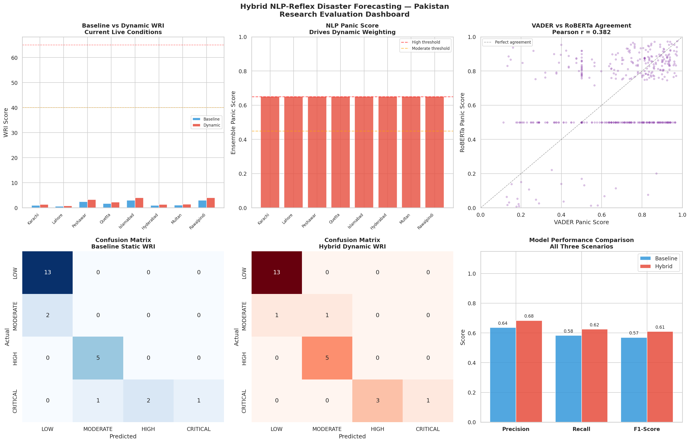

# Hybrid NLP-Reflex Disaster Forecasting System
### Real-Time Risk Assessment for Pakistan Using Sentiment Analysis

## Overview

This project develops a hybrid disaster forecasting system that combines live meteorological data with NLP-derived sentiment scores to produces a dynamic Weather Risk Index (WRI) for eight major cities.

The core research contribution is the transformation of a static formula into an adaptive forecasting agent that responds to physical sensor readings and human percieved risk signals extracted from real disaster tweets.

## System Architecture
```
Live Weather Data (Open-Meteo API)
        ↓
Baseline WRI Calculation
        ↓
NLP Sentiment Layer ← Disaster Tweets (7,500 labelled texts)
  VADER (baseline)      Figure Eight / HuggingFace Dataset
  RoBERTa (advanced)    GDACS UN Alerts
  Ensemble Score
        ↓
Dynamic WRI Formula (panic amplification)
        ↓
Memory Agent (rolling window + trend detection)
        ↓
Real-Time City Alerts
        ↓
Validation against historical disaster scenarios
```

## Data Sources

| Source | Description | Access |
|--------|-------------|--------|
| Open-Meteo API | Live weather data | Free, no key required |
| NLP Disaster Tweets (Figure Eight, 2019) | 7,613 labelled disaster tweets | HuggingFace Datasets |
| GDACS RSS Feed | UN real-time disaster alerts | Free, no key required |

## NLP Models

**Model 1 — VADER (Hutto and Gilbert, 2014)**
Rule-based lexicon model extended with a 22-word disaster-specific 
vocabulary. Serves as the baseline NLP model.

**Model 2 — RoBERTa (Cardiff NLP, 2022)**
Transformer architecture pre-trained on 124 million tweets. 
Fine-tuned for three-class sentiment classification. Serves as 
the advanced NLP model.

**Ensemble**
Simple average of both model outputs. Pearson correlation between 
models r = 0.382, confirming they capture complementary signals 
and justifying the ensemble approach.

## Results

Validated across three scenarios:
- Scenario A: Current live conditions
- Scenario B: 2022 Pakistan Monsoon Floods (NDMA, 2022)
- Scenario C: Cyclone Biparjoy 2023 (PMD, 2023)

| Metric | Baseline (Static) | Hybrid (NLP) | Improvement |
|--------|------------------|--------------|-------------|
| Precision | 0.6361 | 0.6835 | +4.74% |
| Recall | 0.5833 | 0.6250 | +4.17% |
| F1-Score | 0.5696 | 0.6091 | +3.95% | 

## Memory Agent

The system includes a memory-based forecasting agent that:
- Maintains a rolling window of the last 12 WRI readings
- Detects whether risk is rising, stable or falling using 
  linear regression slope
- Combines current WRI, trend direction and sustained panic 
  level to generate context-aware alerts
- Issues alerts across five levels: NORMAL, ADVISORY, WATCH, 
  WARNING, EMERGENCY
## Dashboard




## How to Run

1. Open 'Pakistan_Disaster_Forecasting.ipynb' in Google Colab
2. Click **Runtime → Run all**
3. No API keys required — all data sources are free and open

## Dependencies
```
vaderSentiment
transformers
torch
feedparser
datasets
requests
pandas
numpy
matplotlib
seaborn
scikit-learn
```
